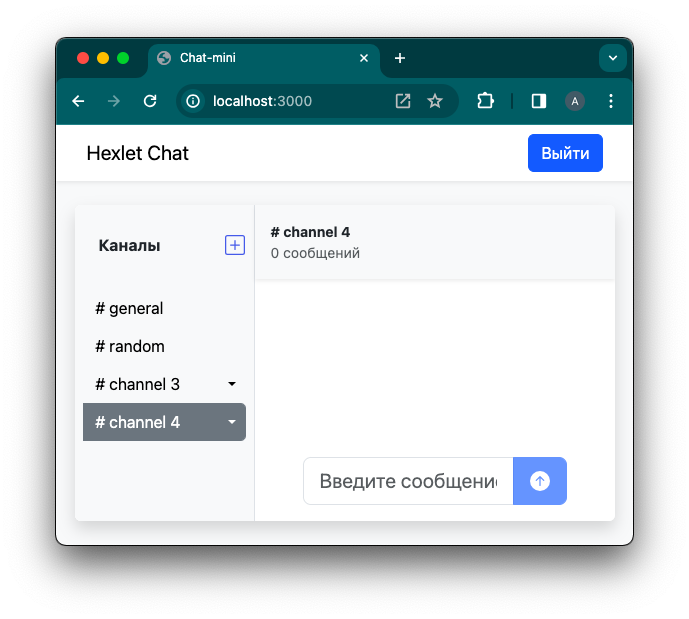

### Hexlet tests and linter status:
[](https://github.com/temikis/frontend-project-12/actions)
[](https://github.com/temikis/frontend-project-12/actions)
[](https://codeclimate.com/github/temikis/frontend-project-12/maintainability)

---
# Project "miniChat"
### Description
A minichat that has a login and registration page. It also supports creating, renaming and deleting channels, which is done through a modal window. Chat messages are moderated using a censorship filter.

---
### Demonstration:
[Project link on Render](https://minichat-xwkx.onrender.com)

---
### Requirements:
Node.js: 16 and above

---
### Installation: 
Download the program and run the following commands in its root directory:
```
make install
make build
make develop
```
---
### Tools used:
- [React-Bootstrap](https://react-bootstrap.netlify.app/)
- [redux-toolkit](https://redux-toolkit.js.org/)
- [react-router-dom](https://reactrouter.com/en/main)
- [formik](https://formik.org/)
- [i18next](https://www.i18next.com/)
- [yup](https://github.com/jquense/yup)
- [axios](https://axios-http.com/)
- [leo-profanity](https://www.npmjs.com/package/leo-profanity)
- [socket.io](https://socket.io/)
- [react-toastify](https://www.npmjs.com/package/react-toastify)
- [rollbar](https://docs.rollbar.com/docs/react)
